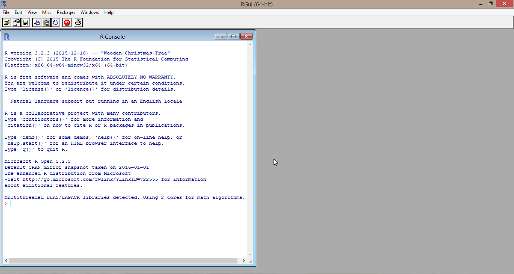
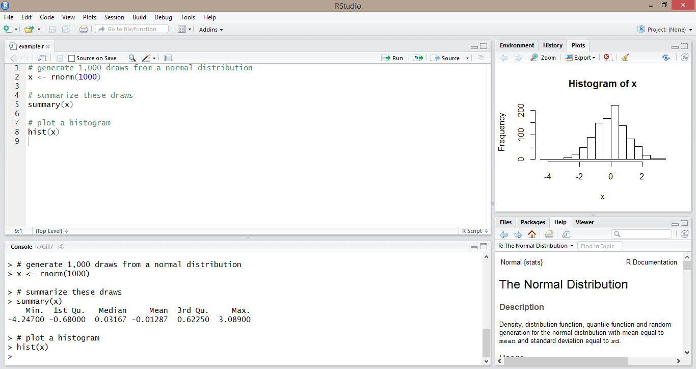
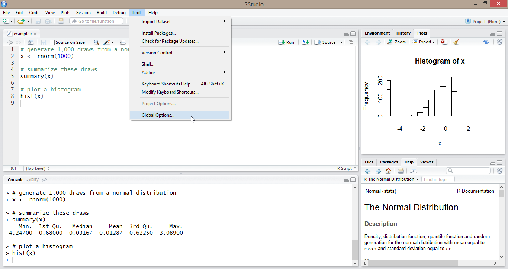
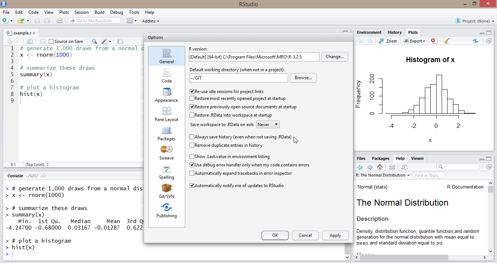
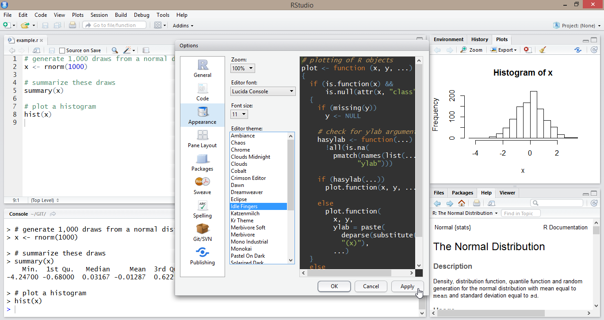
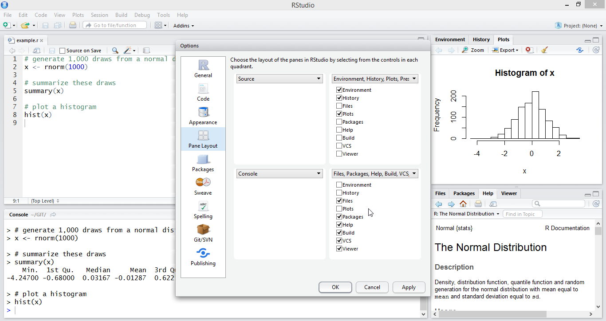

```{r setup, include=F, purl=F}
library(data.table)
library(ggplot2)
library(ggcats)
knitr::opts_chunk$set(fig.width=6, fig.height=4, out.width="80%")
# options(width=60)
# knitr::knit_hooks$set(document = function(x) gsub("```\n+```\n", "", x),
#                       size = function(before, options, envir) if (before) return(options$size))
```

# In this lecture

<!-- ###################################################################### -->
<!-- ############################### MONDAY ############################### -->
<!-- ###################################################################### -->

1. What is R? 
2. RStudio interface
3. Packages
4. R as calculator 
5. Anatomy of a function
6. Help files
7. R scripts 

# What is R? 

- R is a language for statistical computing and graphics
\vspace{10pt}
- Originally developed in 1992 by Robert Gentleman and Ross Ihaka based on the programming language S 
\vspace{10pt}
- The core of the R language is maintained by the R Core Team
\vspace{10pt}
- A (very) large number of packages which add additional functionality are maintained by other contributors 

# Why use R? 

- R can do many useful things 
    - Flexible data management
    - Powerful statistical capabilities, particularly for modeling 
    - Extensive graphics capabilities 

. . . 

\vspace{10pt}

- R is free software 
    - You don't have to pay for it (and you can share it with anyone) 
    - You can use and modify it as you see fit 

. . . 

\vspace{10pt}

- R has a large (and enthusiastic) user base 
    - This makes finding help relatively straightforward 
    - New methods are often implemented in R very quickly 

# R (GUI) interface



# What is RStudio? 

- "Integrated development environment" (IDE)

. . . 

\vspace{10pt}

- Convenient interface for R which incorporates a number of useful features for developing code 
    - syntax highlighting
    - code completion
    - code navigation 
    - debugging tools
    - etc. 

. . . 

\vspace{10pt}

- Also provides integration with other useful tools 
    - Shiny (for developing web apps)
    - R Markdown (for authoring documents and slides)
    - Git/Subversion (for version control)

# RStudio interface



# RStudio interface



# RStudio interface



# RStudio interface



# RStudio interface



# Packages

Most basic R functionality is part of `base` and is loaded automatically when you start R. 
Additional functionality can be added through packages. 

. . . 

\vspace{20pt}
The first time you use a package, it needs to be installed: 

```{r, eval=F}
install.packages("ggplot2")
```

After that, you just need to load the package using the `library()` command whenever you start a new instance of R: 

```{r, eval=F}
library(ggplot2)
```

# R as calculator 

R can be used as a calculator by just typing in the console. 

\vspace{20pt}
All of the basic arithmetic operators (+, -, *, /, ^) do what you would expect them to do, following normal order of operations conventions:

```{r}
230 + 97
500/20
```

# R as calculator 

Parentheses can be used to alter the order of operations: 

```{r}
300/20^1/2
(300/20)^(1/2)
```

# R as calculator: Quick exercise

1. How many seconds are in September? 

2. What is 80 degrees Fahrenheit in degrees Celsius? 

3. How much longer is 1 mile than 1600 meters (in feet)? 

# R as calculator: Quick exercise

1. How many seconds are there in September? 

```{r}
30 * 24 * 60 * 60
```

2. What is 80 degrees Fahrenheit in degrees Celsius? 

```{r}
(80 - 32)*(5/9)
```

3. How much longer is 1 mile than 1600 meters (in feet)? 

```{r}
5280 - 1600*3.28084
```

# Functions 

R functions are used to transform input into output in some way. 

For example... 

```{r}
log(10)
```

```{r}
exp(3)
```

```{r}
sqrt(80)
```

# Functions: anatomy 

```{r}
log(x = 300, base = 10)
```

1. Function name: **`log()`**

2. Argument name(s): **`x`, `base`**

3. Argument value(s): **`300`, `10`**

4. Output: **``r log(x = 300, base = 10)``**

# Functions: argument order

Arguments can be specified in any order *if they are named*: 

```{r}
log(x = 300, base = 10)
```

```{r}
log(base = 10, x = 300)
```

# Functions: argument names 

Arguments don't need to be named, but then *there is only one correct order*: 

\small
```{r}
log(x = 300, base = 10)
log(base = 10, x = 300)
```

```{r}
log(300, 10)
log(10, 300)
```

# Functions: defaults

Some (but not all) arguments have defaults and don't need to be specified, assuming you are happy with the default: 

```{r}
log(x = 300)
```

```{r, error=T}
log(base = 10)
```

# Functions: combining

Functions can be combined or nested with other functions and operators: 

```{r}
exp(log(10) + log(10))
```

```{r}
log(x = (4 * 10) / 7, base = 10)
```

# Help files

Every function has a help file. 

\vspace{20pt}
You can access a help file from the console: 

```{r, eval=F}
help(log)
```

or from the help tab in RStudio: 

\includegraphics[width=1.5in]{images/help_tab.png}

# Help files

\includegraphics[width=4in]{images/help_file_1.png}

# Help files

\includegraphics[width=4in]{images/help_file_2.png}

# Help files

\includegraphics[width=4in]{images/help_file_3.png}

# Help files

\includegraphics[width=4in]{images/help_file_4.png}

# R scripts 

An R script is a text file (`.r` extension) with a series of R commands and (ideally) some useful commentary. 

\includegraphics[width=3.5in]{images/r_script.png}

# Why use a script? 

Typing in the console is fine for quick calculations or experimentation with a command, but a script provides... 

- a full record of all commands required to carry out an analysis
- a convenient mechanism for repeating an analysis without needing to retype everything (no need to reinvent the wheel)
- a starting point for writing new code
- a vehicle for providing context and commentary for your code

# Why use a script? 

**\textcolor{red}{Any analysis you do should be saved as a script!}**

\vspace{20pt}

Without a script...

- you will forget what you've done 
- you will forget why you did it
- no one else will ever know what you did or why you did it
- you will have do things over again for no reason

# Running a script 

If your script is open in RStudio, you can run the whole thing using `ctrl + shift + enter` or just a single line (or highlighted block) using `ctrl + enter`.  

Or you can run a script from the command line using the `source()` function: 

```{r, eval=F, size="\\small"}
source("C:/Users/ngraetz/Dropbox/my_script.R")
```

# Commenting a script 

R will ignore any line in a script that starts with `#`, so you can use this to add comments to your code:  

```{r}
# add 1-5
1 + 2 + 3 + 4 + 5

# find the natural log of 10
log(10)
```

# Commenting a script

Use comments to: 

- Label blocks of code. This will help you navigate your code later 
- Explain why you're doing something (if it's not self-evident) 
- Write yourself (and other users) notes about particularly tricky lines of code

. . . 

You want to provide enough information so that your future self, or someone else, can quickly understand the structure and purpose of your code at a later date. 

**However,** it is possible to provide too much information, making your code more cumbersome (e.g., writing out what each line of code does).

# Headers

It's also good practice to use '#' to provide some sort of header at the top of your code: 

\tiny
```{r, results='hide', tidy=F, prompt=F}
############################################################
## Author:      John Doe
##
## Description: A short description of what this code does
##              and any important context for why. 
##
## Output:      A list of files that are output by this 
##              code. 
##
## Notes:       Anything someone should know when running
##              this code. 
############################################################
```

# Data visualization

<!-- ######################################################################### -->
<!-- ############################### WEDNESDAY ############################### -->
<!-- ######################################################################### -->

1. Understanding the `ggplot` approach
2. Aesthetics
3. Geoms
4. Facets
5. Options and customization
6. Reshaping
7. Saving plots
8. Additional packages

# What is `ggplot2`?

* `ggplot2` contains functions that allow you to build complex graphics using a relatively small set of building blocks

* It's based on the book "Grammar of Graphics", which defined a fundamental theory of data visualization

* NOTE: the online documentation for `ggplot2` is fantastic, and lays all the functions out in terms of these building blocks: 

\tiny
http://ggplot2.tidyverse.org/reference/

https://www.rstudio.com/wp-content/uploads/2015/03/ggplot2-cheatsheet.pdf

# Load libraries & data

\tiny
```{r, include=T}
library(ggplot2)
library(data.table)
mmr_data <- fread("data/mmr_data.csv")
head(mmr_data)
```

# How does `ggplot2` work?

First, you set up the graph:

\small
```{r, include=T}
plot <- ggplot(data = mmr_data,
               aes(x = maternal_education,
                   y = ldi))
```

# How does `ggplot2` work?

\small
```{r, echo=FALSE}
print(plot)
```

# How does `ggplot2` work?

Then, you add to it. Basically telling `ggplot` what type of graph to make:

\small
```{r, include=T}
plot <- ggplot(data = mmr_data,
               aes(x = maternal_education,
                   y = ldi)) +
  geom_point()
```

# How does `ggplot2` work?

\small
```{r, echo=FALSE}
print(plot)
```

# What are the building blocks of a ggplot?

  - **Aesthetics**

  - **Geoms**

  - **Facets**

  - Positions

  - Scales

  - Labels

  - Themes

# Aesthetics

We map aesthetics with `aes` in the initial `ggplot()` call:

\small
```{r, tidy=F, fig.keep='none'}
ggplot(data = mmr_data, 
       aes(x = maternal_education, 
           y = ldi)) +
  geom_point()
```

# Aesthetics

The `aes` in the initial `ggplot()` call

"Aesthetic mapping" is how you tell `ggplot` which variable is `x`, which is `y`

**But**, you can use them for more than just the axes:

  - color (border color)
  - fill (fill color)
  - shape
  - linetype (solid, dashed, dotted etc.)
  - size
  - alpha (transparency)
  - labels

# Example of aesthetic mapping

\small
```{r, tidy=F, fig.keep='none'}
plot <- ggplot(data = mmr_data, 
               aes(x = maternal_education, 
                   y = ldi,
                   color = super_region_name)) +
  geom_point()
```

# Example of aesthetic mapping

\small
```{r, echo=FALSE}
print(plot)
```

\normalsize
Note that `ggplot` conveniently makes a legend for you! In ggplot lingo, legends are called "scales"

# Example of aesthetic mapping

In many cases, aesthetic mapping works for both continuous and categorical data:

\small
```{r, tidy=F, fig.keep='none'}
plot <- ggplot(data = mmr_data, 
               aes(x = maternal_education, 
                   y = ldi,
                   color = mmr)) +
  geom_point()
```

# Example of aesthetic mapping

\small
```{r, echo=FALSE}
print(plot)
```

# Example of aesthetic mapping

\small
`ggplot` allows you to manipulate variables "on the fly":

```{r, tidy=F, fig.keep='none'}
plot <- ggplot(data = mmr_data, 
               aes(x = maternal_education,
                   y = log(ldi), 
                   color = mmr)) +
  geom_point()
```

# Example of aesthetic mapping

\small
```{r, echo=FALSE}
print(plot)
```

# Example of aesthetic mapping

You can keep adding more aesthetics to add more information to your graph:

\small
```{r, tidy=F, fig.keep='none', size = "\\small"}
plot <- ggplot(data = mmr_data, 
               aes(x = maternal_education, 
                   y = ldi,
                   color = mmr, 
                   shape = super_region_name)) +
  geom_point()
```

Note that not all aesthetics are meaningful for all geoms (e.g., linetype doesn't make sense if there are no lines in your graph)

# Example of aesthetic mapping

\small
```{r, echo=FALSE}
print(plot)
```

# What are the building blocks of a ggplot?

  - **Aesthetics**

  - **Geoms**

  - **Facets**

  - Positions

  - Scales

  - Labels

  - Themes

# Geoms

`ggplot` "geoms" (geometries) are the different types of graphs you can make:

  - `geom_point()` for scatter plots
  - `geom_line()` for line graphs
  - `geom_bar()` for bar graphs    
  - And more: `geom_histogram()`, `geom_violin()`, `geomboxplot()`, `geom_errorbar()`, `geom_ribbon()`, `geom_segment()`, `geom_path()`, `geom_tile()`, `geom_polygon()`, etc. 

There are dozens of different geometries you can use for ggplot.

See the ggplot cheat sheet for the whole list: https://www.rstudio.com/wp-content/uploads/2015/03/ggplot2-cheatsheet.pdf

# Geoms

If you specify more than one geom, it "layers" them on top of each other

\small
```{r, tidy=F, fig.keep='none', size = "\\small"}
plot <- ggplot(data = mmr_data, 
               aes(x = maternal_education, 
                   y = ldi)) +
  geom_point(size=3,color='red') +
  geom_line(lwd=1)
```

# Geoms

\small
```{r, echo=FALSE}
print(plot)
```

Note: the order matters, it will layer geoms in order that they are written

# Geoms

Aesthetic arguments can also be provided directly to a geom in cases where you don't want them to map to some variable:

\small
```{r, tidy=F, fig.keep='none'}
plot <- ggplot(data = mmr_data, 
               aes(x = maternal_education, 
                   y = ldi)) +
  geom_point(color = 'red', 
             size = 2, 
             alpha = .5)
```

# Geoms

Some libraries provide additional geoms:

\small
```{r, tidy=F, fig.keep='none', size = "\\small"}
library(ggcats)
plot <- ggplot(data = mmr_data, 
               aes(x = maternal_education, 
                   y = ldi)) +
  geom_cat(cat='grumpy',size=3)
```

# Geoms

\small
```{r, echo=FALSE}
print(plot)
```

# What are the building blocks of a ggplot?

  - **Aesthetics**

  - **Geoms**

  - **Facets**

  - Positions

  - Scales

  - Labels

  - Themes

# Facets

Facets allow you to incorporate more complexity into your graphs by adding multiple panels:

\small
```{r, tidy=F, fig.keep='none', message=F}
plot <- ggplot(data = mmr_data, 
               aes(x = maternal_education, 
                   y = ldi)) +
  geom_point() +
  facet_wrap(~super_region_name)
```

# Facets

\small
```{r, echo=FALSE}
print(plot)
```

# Facets

`facet_wrap` stratifies and wraps. You can specify `nrow` and `ncol` to modify dimensions.

\medskip

`facet_grid` forms a grid of panels based on rown and column facetting variables. Example:
`facet_grid(sex ~ age_group)` will create rows of panels based on sex and columns of panels based on age group.

# What are the building blocks of a ggplot?

  - **Aesthetics**

  - **Geoms**

  - **Facets**

  - Positions

  - Scales

  - Labels

  - Themes

# Positions

`ggplot` lets you modify where geoms appear relative to each other, using `position` functions:

  - `position_jitter()` randomly displaces points (usually just for `geom_point`)

  - `position_dodge()` automatically (tries to) shift to avoid overlap

  - `position_stack()` stack, or add together geoms (usually just for `geom_bar`)

  - `position_fill()` rescale the y-axis so the geoms sum to 100% (usually just for `geom_bar`)

# Positions

`position_jitter` randomly displaces points (usually just for `geom_point`)

\small
```{r, tidy=F, fig.keep='none', message=F, "\\small"}
plot <- ggplot(data = mmr_data, 
               aes(x = maternal_education, 
                   y = ldi)) +
  geom_point(position='jitter')
```

# Positions

\small
```{r, echo=FALSE}
print(plot)
```

It's built right into the `geom_point()` function for convenience.

# Positions

`position_stack` is the default for `geom_bar` for factor variables:

\small
```{r, tidy=F, fig.keep='none', message=F, size="\\small"}
mmr_data$category <- cut(mmr_data$maternal_education,
                         breaks=c(0, 3, 6, 9, 12, Inf))
plot <- ggplot(data = mmr_data, 
               aes(x = category, 
                   fill = super_region_name)) +
  geom_bar()
```

# Positions

\small
```{r, echo=FALSE}
print(plot)
```

# Positions

`position_dodge` would put the bars side-by-side:

\small
```{r, tidy=F, fig.keep='none', message=F, size = "\\small"}
plot <- ggplot(data = mmr_data, 
               aes(x = category, 
                   fill = super_region_name)) +
  geom_bar(position = 'dodge')
```

# Positions

\small
```{r, echo=FALSE}
print(plot)
```

It's built right into the `geom_bar()` function for convenience.

# Positions

`position_fill` makes the bars sum to 100%:

\small
```{r, tidy=F, fig.keep='none', message=F, size = "\\small"}
plot <- ggplot(data = mmr_data, 
               aes(x = category, 
                   fill=super_region_name)) +
  geom_bar(position='fill')
```

# Positions
\small
```{r, echo=FALSE}
print(plot)
```

It's built right into the `geom_bar()` function for convenience

# Scales

You can also modify the "scales" (i.e., legends) to customize aesthetic mapping:

\small
```{r, tidy=F, fig.keep='none', size = "\\small"}
plot <- ggplot(data = mmr_data, 
               aes(x = maternal_education, 
                   y = ldi,
                   color = super_region_name)) +
  geom_point() +
  scale_color_manual(values = c('red','yellow',
                                'blue', 'green',
                                'purple','#31a354'))
```

# Scales

\small
```{r, echo=FALSE}
print(plot)
```

Every aesthetic (fill, color, shape, linetype) has corresponding `scale_*` function (`scale_fill_manual`, `scale_color_manual` etc.)

# Scales

I recommend using the `viridis` library for colors: 

\small
```{r, tidy=F, fig.keep='none', size = "\\small", warning=F}
library(viridis)
plot <- ggplot(data = mmr_data, 
               aes(x = maternal_education, 
                   y = ldi,
                   fill = super_region_name)) +
  geom_point(shape=21,size=5) +
  scale_fill_viridis_d()
```

# Scales

\small
```{r, echo=FALSE}
print(plot)
```

# Labels

Titles for everything can be added with the `labs()` function:

\small
```{r, tidy=F, fig.keep='none', size = "\\small"}
plot <- ggplot(data = mmr_data, 
               aes(x = maternal_education,
                   y = ldi,
                   fill = super_region_name)) +
  geom_point(shape=21,size=5) +
  scale_fill_viridis_d() + 
  labs(title = 'Maternal Education Compared to LDI', 
       y = 'LDI',
       x = 'Education', 
       fill = 'GBD Super Region')
```

# Labels

\small
```{r, echo=FALSE}
print(plot)
```

# Themes

`ggplot` also comes with handy "themes", or preset options:

\small
```{r, tidy=F, fig.keep='none'}
plot <- ggplot(data = mmr_data, 
               aes(x = maternal_education,
                   y = ldi,
                   fill = super_region_name)) +
  geom_point(shape=21,size=5) +
  scale_fill_viridis_d() + 
  labs(title = 'Maternal Education Compared to LDI', 
       y = 'LDI',
       x = 'Education', 
       fill = 'GBD Super Region') + 
  theme_bw()
```

# Themes

\small
```{r, echo=FALSE}
print(plot)
```

# Themes

Themes also allow you to adjust visuals that are not aesthetics:

\small
```{r, tidy=F, fig.keep='none'}
plot <- ggplot(data = mmr_data, 
               aes(x = maternal_education,
                   y = ldi,
                   fill = super_region_name)) +
  geom_point(shape=21,size=5) +
  scale_fill_viridis_d() + 
  labs(title = 'Maternal Education Compared to LDI', 
       y = 'LDI',
       x = 'Education', 
       fill = 'GBD Super Region') + 
  theme_bw() + 
  theme(axis.title.x = element_text(size=16))
```

# Themes

\small
```{r, echo=FALSE}
print(plot)
```

# Reshaping

`ggplot2` is designed to work with data shaped such that each desired aesthetic is mapped to **one** variable.
If your data is not shaped this way, it's almost always easier to reshape the data than to try and make `ggplot2` work with original data structure.

# Reshaping

For example, if you want to plot the number of Ebola deaths by age group for both males and females, this is an inconvenient data structure since there are separate columns for deaths among males and females:

\small
```{r, echo=F}
long_data <- fread("data/ebola_fatalities_sex_country.csv")
wide_data <- dcast(long_data, 
                   Country + Age ~ Gender, 
                   value.var = "Deaths")
head(wide_data)
```

# Reshaping

One option is to just add different geoms for each variable:

\small
```{r, tidy=F, fig.keep='none', message=F, size = "\\small"}
plot <- ggplot(data = wide_data,
               aes(x = Age)) +
  geom_line(aes(y = Male), color = 'blue', lwd=1) +
  geom_line(aes(y = Female), color = 'red', lwd=1) + 
  facet_wrap(~Country) + 
  theme_bw()
```

# Reshaping

\small
```{r, echo=FALSE}
print(plot)
```

# Reshaping

A better option is to reshape \textbf{long} before attempting to plot these data:

\small
```{r, tidy=F, fig.keep='none', size="\\small"}
long_data <- melt(wide_data, 
                  id.vars = c("Country", "Age"),
                  value.name = "Deaths", 
                  variable.name = "Sex")
head(long_data, 3)
```

# Reshaping

\small
```{r, tidy=F, fig.keep='none', message=F, size = "\\small"}
plot <- ggplot(data = long_data,
               aes(x = Age,
                   y = Deaths,
                   color = Sex)) +
  geom_line(lwd=1) +
  facet_wrap(~Country) + 
  theme_bw()
```

# Reshaping

\small
```{r, echo=FALSE}
print(plot)
```

# Saving plots

You can save your plot directly into a pdf or image file.

Use "ggsave" and specify an output file type:

```{r, size="\\small"}
ggsave('images/my_plot.pdf')
```

# Additional packages

`ggplot2` has become so popular that other users have started writing add-ons to it:

  - **`cowplot`** - plot tables and arrange multiple plots together

  - **`ggrepel`** - label points nicely

  - **`viridis`** - easy-to-use color schemes 

  - **`ggthemes`** - more themes, preset colors


# Additional package: `cowplot`

\tiny
```{r, tidy=F, fig.keep='none', warning=F}
library(cowplot)
plot <- ggplot(data = mmr_data, 
               aes(x = maternal_education,
                   y = ldi,
                   fill = super_region_name)) +
  geom_point(shape=21,size=5) +
  scale_fill_viridis_d(guide='none') + 
  labs(title = 'Maternal Education Compared to LDI', 
       y = 'LDI',
       x = 'Education', 
       fill = 'GBD Super Region') + 
  theme_bw()
plot2 <- ggplot(data = mmr_data, 
                aes(x = category, 
                    fill = super_region_name)) +
  geom_bar(position='fill') + 
  scale_fill_viridis_d(guide='none') + 
  theme_bw()
```

# Additional package: `cowplot`

\small
```{r, echo=FALSE}
plot_grid(plot,plot2,ncol=2)
```

# Additional package: `ggrepel`

\small
```{r, tidy=F, fig.keep='none'}
library(ggrepel)
plot <- ggplot(data = mmr_data, 
               aes(x = maternal_education,
                   y = ldi,
                   fill = super_region_name,
                   label = location_name)) +
  geom_point(shape=21,size=5) +
  geom_text_repel() + 
  scale_fill_viridis_d(guide='none') + 
  labs(title = 'Maternal Education Compared to LDI', 
       y = 'LDI',
       x = 'Education', 
       fill = 'GBD Super Region') + 
  theme_bw()
```

# Additional package: `ggrepel`

\small
```{r, echo=FALSE, warning=F}
print(plot)
```
